# Fake Donald Trump
Fake Trump's faces generated by GAN, study only

## Data Resource

From [Kaggle Trump Photo Dataset](https://www.kaggle.com/mbkinaci/trump-photos), I already upload cropped and resized(64 *  64) Trump face image to Kaggle [HERE](https://www.kaggle.com/yilingliu610/donald-trump-face-images)

Trump's photos are also available by using [Python Google Image Downloading Tool](https://github.com/hardikvasa/google-images-download)

Tests could be found in another project also wrote by myself: [Generate House Number by Yiling](https://github.com/610yilingliu/GenerateHouseNumber), Some of the code in this project are also copied from Generate House Number.

Generate House Number(TensorFLow version) is a project that I created for students who studying AI in the University of Western Australia to study DCGAN with detailed comment about Python and computer vision.

Folder `avatar_trump` is just an interesting bug happen while I am doing this project:)

## General Process

- Crop Trump's face from photos in mentioned data resources with OpenCV, dlib and face_recognition library(in [`get_face.py`](./pkg/get_face.py))
- Resize face into 64 * 64 images
- Convert those 64 * 64 image to an numpy dataset for further use
- Apply DCGAN, visualization and logging are applied during the training process and the images generated while training will be in './report_imgs' and the losses and model will be in `./logs` by default

## Applied techs

- DCGAN
- Dynamic learning rate

Also explored relu + relu and leaky-relu + leaky-relu in Generator and Discriminator and analyze the influence with the those changes toward the result. It will be discussed later in this document.

## Usage
I am using VSCode to debugging and running this project in my own machine(I am currently in China and Colab is not very stable to visit with my own AWS vpn).

You can use IDE to open this folder as a project, and run `__main__.py`.

You can also add prefix `pkg.` for all imports(not include library installed in the environment) under pkg folder and type `python -m pkg` to run.

## Requirements

- Python 3
- TensorFlow 2.0+
- Numpy
- OpenCV
- [face_recognition](https://github.com/ageitgey/face_recognition)
- dlib
  
Scipy is not really needed, if you haven't installed Scipy and got an errorr in `get_npz.py`, fell free to remove `import scipy.io` and function `mat_tonpz`. That function aims to convert .mat file to .npz file, but we are using images here.

## Report

Infrastructure of DCGAN(image from the internet)


The original DCGAN training model that [Yuliya uses as example](https://github.com/YuliyaLab/AIclass/blob/master/L9_DCGAN_housenum_1.ipynb) uses `lr = 0.0002` as learning rate, but it is too slow for training result to converge to a human-eyes-qualified result.

All result images and logs are available [HERE](./results)

Examples of source Trump's face
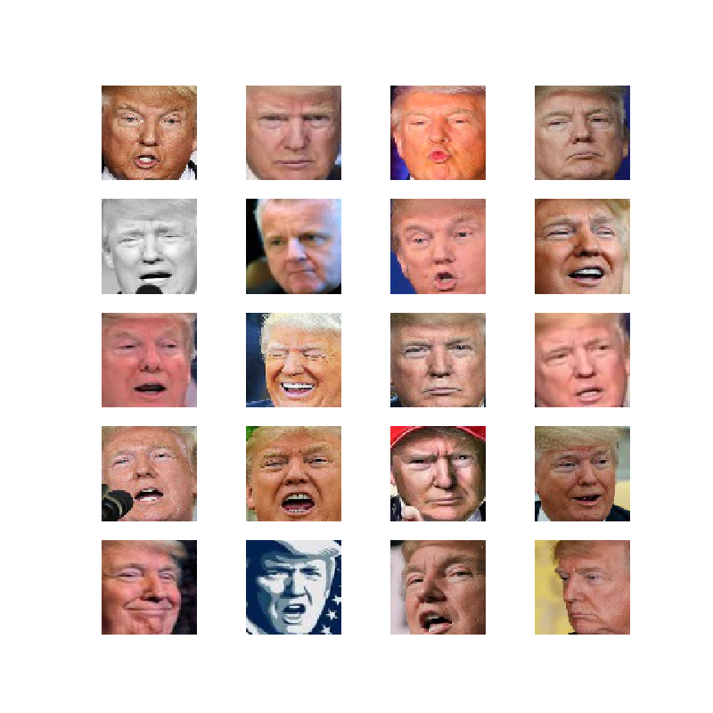
### 1. DCGAN(lr == 0.0002)

With `lr == 0.0002`, we can see that the Trump's face is very fuzzy in epoch 200
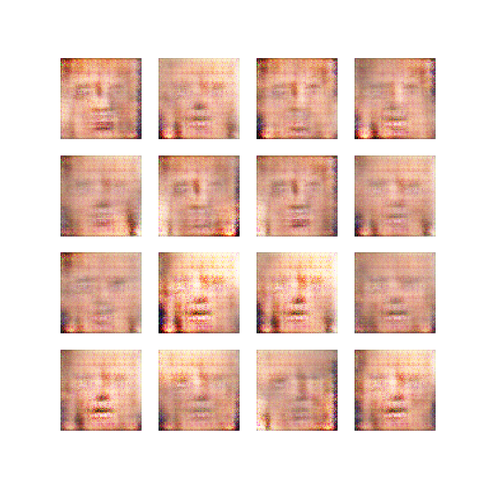

And in epoch 4600 we can get some result that is close to a real Trump

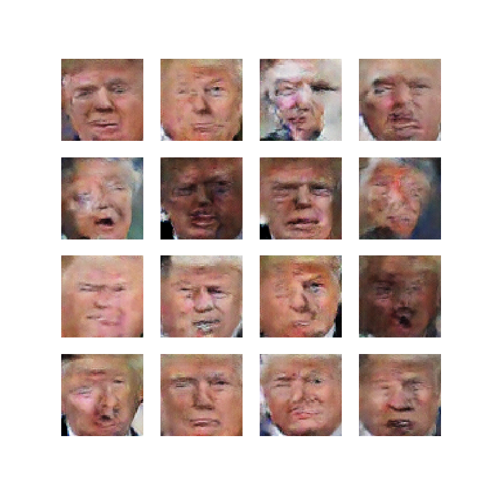

The image in row 4, col 2 looks like a photoed Trump, isn't it :)

Loss in 5000 epoch could be plotted as figure below, it takes 320 minutes 20 seconds to finish the whole training process. Full log of the training process could be found in [log file here](./results/no_changing_lr/2020_09_15_01_37.log)

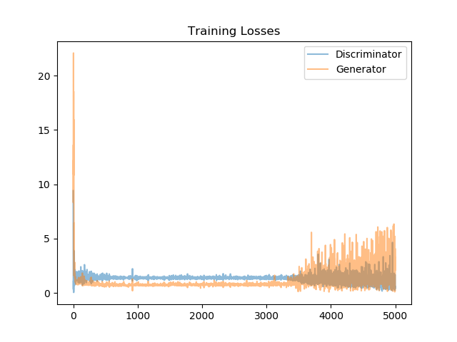

### 2. DCGAN(Dynamic Learning Rate)

To accelerate the training process, I apply the discrete learning rate to DCGAN based on the current training epoch with function `change_lr` and 

```py
def change_lr(new_lr):
    d_optimizer.lr.assign(new_lr)
    g_optimizer.lr.assign(new_lr)
```

```py
# lr initialized as 0.02 in the first epoch
if epoch == 50:
    lr = 0.01
    change_lr(lr)
elif epoch == 100:
    lr = 0.005
    change_lr(lr)
elif epoch == 150:
    lr = 0.002
elif epoch == 200:
    lr = 0.001
elif epoch == 300:
    lr = 0.0002
```

The reason why I haven't choose an exponential function is that with the increasement of epochs, the learning will approach to 0 (while $e \rightarrow \infty$, $lr\rightarrow 0$). The learning rate will be too large at the beginning and too small if the epoch become a large number.

With the dynamic learning I designed above, we can got a human-face like stuff in epoch 50

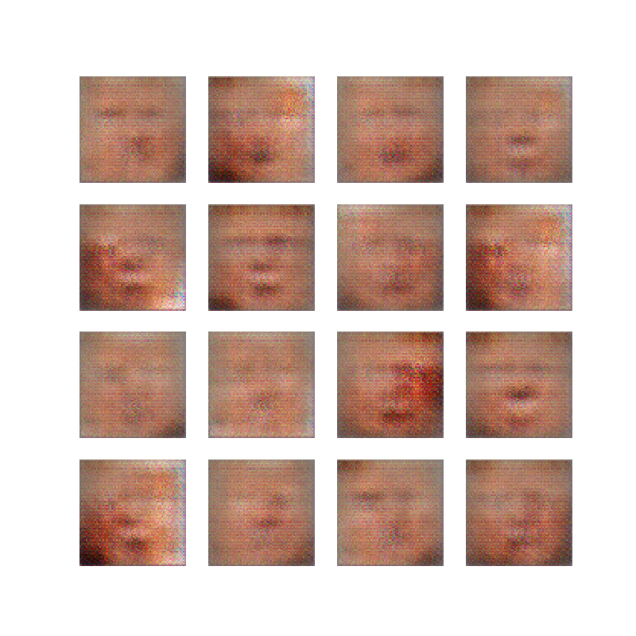

and a image that is much clear than static learning rate(even it is ugly) in epoch 200

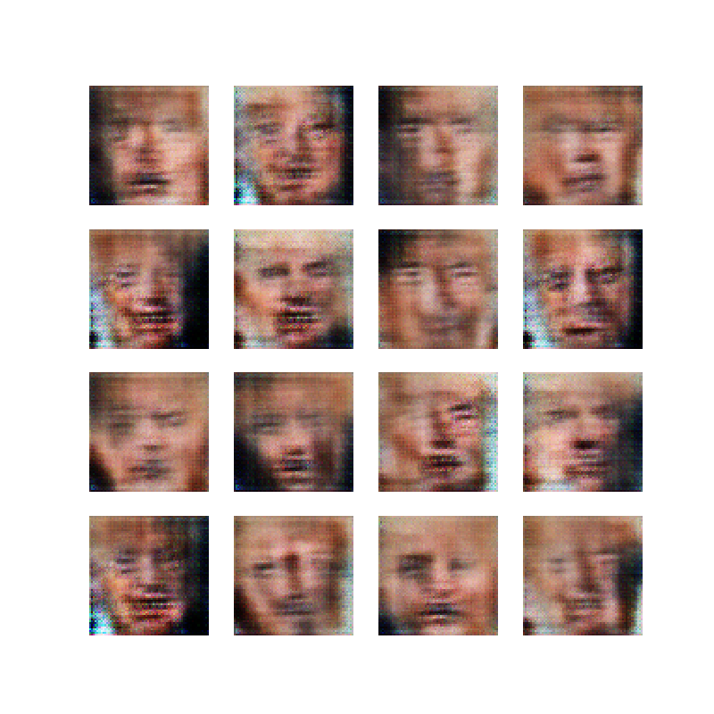

We got a image that looks like a real Trump in epoch 990
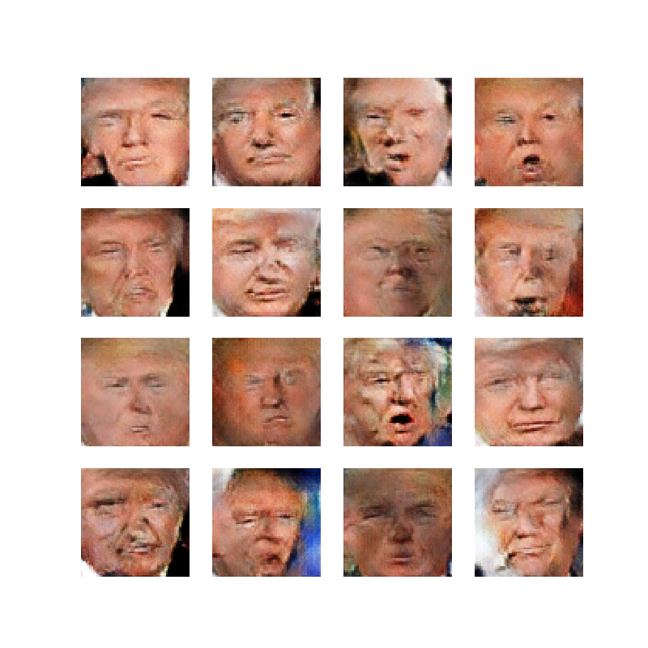

Plot of learning rate in the training process:
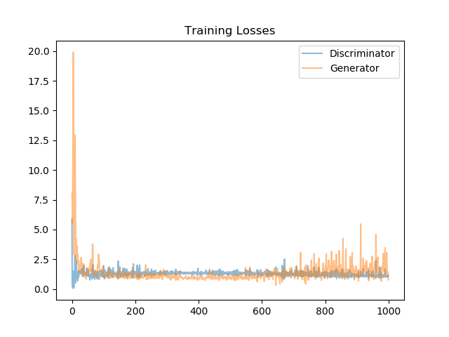

Takes only 67 minutes to train, full log available [HERE](./results/dynamic_lr/2020_09_28_18_32.log)

### 3. Two relu layers in Discriminator and Generator (Dynamic Learning Rate)

For the original DCGAN, we use relu in generator and leaky-relu in discriminator, in this section I tried to apply relu layers to both generator and discriminator to see what will happen.

Human face figure also appears in epoch 40-50

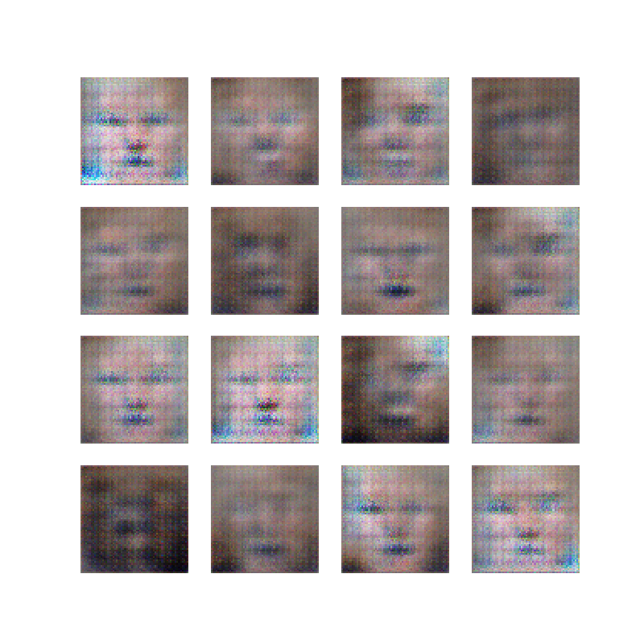

And we got some nice Trump image in epoch 750

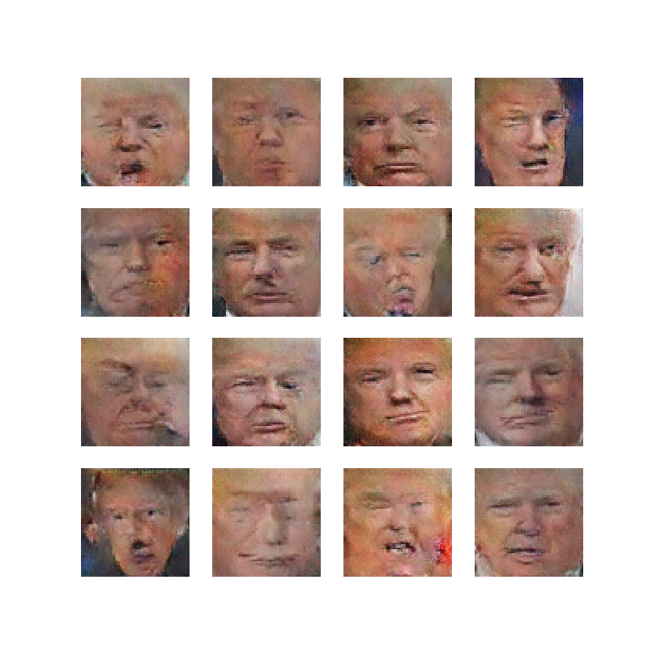

But it is not the end. Relu always throw negative variables for thinning, it also throws out useful features by mistake. So the important features in this image are losses continuously after epoch 850.

Epoch 860:

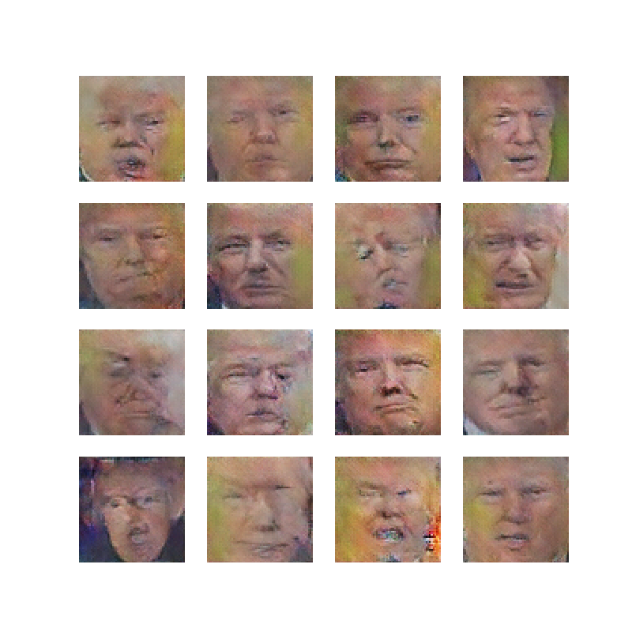

Epoch 1000:


For other models, the training result after "best epoch" might not as good as the result in previous epoch but will not that much.

Losses in training process:
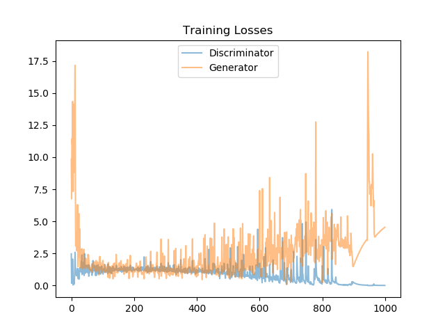

Full log available [HERE](./results/two_relus/2020_09_28_14_11.log)

### 3. Two leaky-relu layers in Discriminator and Generator (Dynamic Learning Rate)

Human face figure appears between epoch 50-60

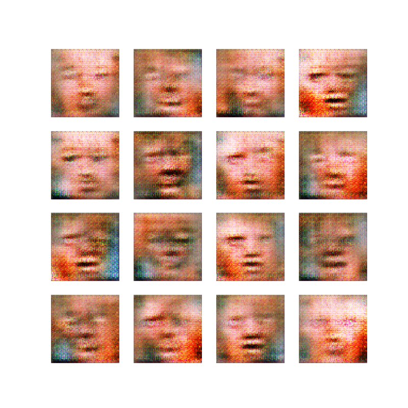

Nice Trump's appears in epoch 980
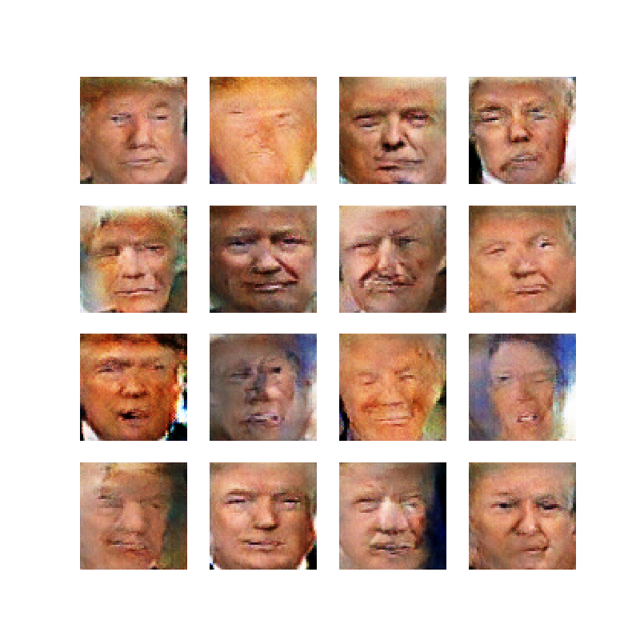

Losses

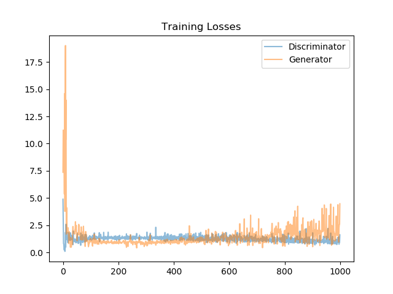

It seems that the result of leaky-relu in both generator and discriminator is similar with the original DCGAN but the time to do leaky-relu is slower than relu(leaky-relu need to do the multiplying, cause extra machine time).

More images and tests are needed to compare DCGAN and 2-l-relu method. But in math ways, leaky-relu in generator keep some unnecessary information. Lower hyperparameter is needed in generator (`alpha` cannot be too large in `tf.nn.leaky_relu(layer, alpha)`) while using it.

Full log available [HERE](./results/two_leakly_relus/2020_09_28_19_46.log)


## Environment

OS: Windows 10

CPU: Intel i7-8750H

Graphics: Nvidia RTX 2070 (laptop)

CUDA v11.0